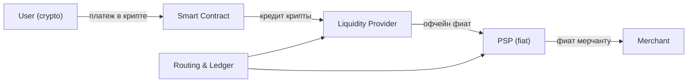

# Crypto-Fiat Routing Protocol

Протокол для мгновенных крипто-платежей через PSP с компенсацией LP.  
Мы выступаем **посредником**, связывая все стороны.

---

## Основные роли

| Роль                               | Функция                                       |
| ---------------------------------- | --------------------------------------------- |
| **User (crypto)**                  | Платит криптой через смарт-контракт           |
| **LP (Liquidity Provider)**        | Держит крипту, компенсирует PSP фиатом офчейн |
| **PSP (Payment Service Provider)** | Платит мерчанту мгновенно фиатом              |
| **Merchant**                       | Получает фиат, не знает про крипту            |

---

## Поток платежа

1. User платит криптой → смарт-контракт → LP
2. PSP мгновенно платит мерчанту фиатом
3. LP компенсирует PSP офчейн
4. Протокол ведёт учёт и маршрутизирует платежи

---

## Схема потоков (Mermaid)

